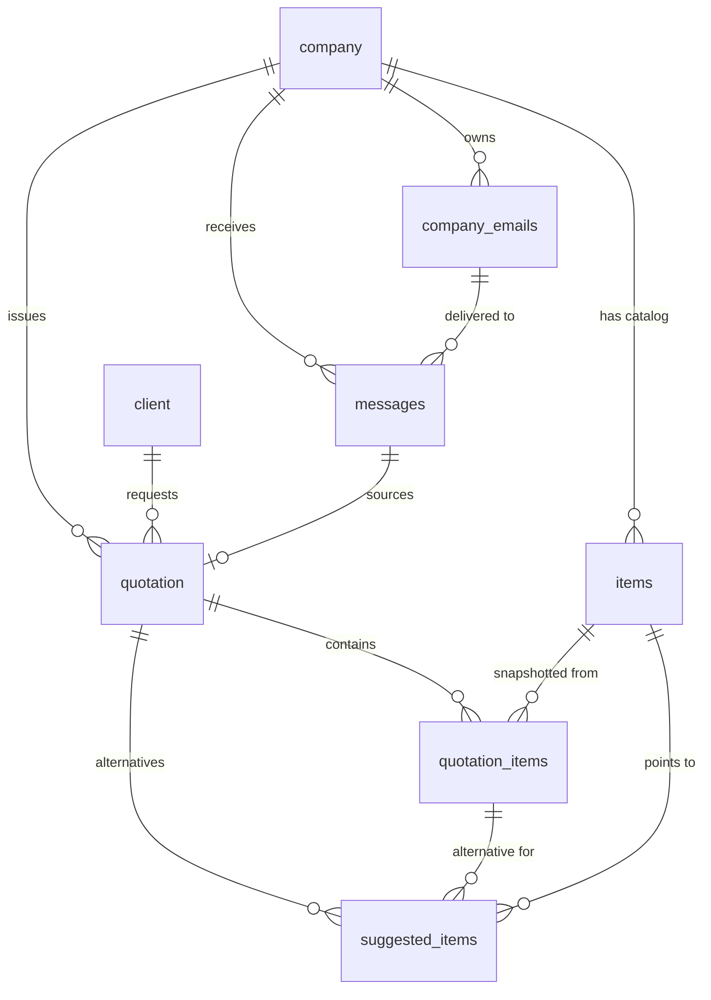

Postgres (via Supabase) is the single source of truth. Every table hangs off **`company`** — the seller organization — and the whole schema exists to turn an inbound `messages` row into a reviewable `quotation`.

## Entity relationships

## The tables

<AccordionGroup>
  <Accordion title="company — the seller organization" icon="building">
    One row per organization using Oblea, owned by the auth user who created it. Provisioned automatically when a user confirms their account.

    | Column | Type | Notes |
    | --- | --- | --- |
    | `id` | uuid | Primary key |
    | `user_id` | uuid | → `auth.users(id)`. The owner. Unique. |
    | `name` | text | **Required** |
    | `logo` · `address` · `phone` · `email` | text | Seller header data |
    | `created_at` | timestamptz | |

    Every platform request resolves to exactly one `company` via `user_id`.
  </Accordion>

  <Accordion title="client — the customer requesting a quote" icon="user">
    The person or business asking for a quotation. Extracted from the email body/signature by the agent and inserted when a draft is filled.

    | Column | Type | Notes |
    | --- | --- | --- |
    | `id` | uuid | Primary key |
    | `name` | text | **Required** |
    | `company` | text | Customer's company name (free text) |
    | `address` · `phone` · `email` | text | |
    | `created_at` | timestamptz | |

    <Note>There is no standalone endpoint to create a client. Clients are created as a side effect of [`POST /quotations/{id}`](/quotations/store-agent-draft), which also links the new row via `quotation.client_id`.</Note>
  </Accordion>

  <Accordion title="items — the company's catalog" icon="boxes-stacked">
    The seller's product catalog, populated by inventory ingestion. This is what Pinecone vectors point back to; it is never tied to a quotation directly.

    | Column | Type | Notes |
    | --- | --- | --- |
    | `id` | uuid | Primary key |
    | `company_id` | uuid | → `company(id)` |
    | `sku` | text | **Required**. Unique per company. |
    | `brand` · `description` | text | |
    | `eta` | int | Lead time in days |
    | `price` · `stock` | numeric | |
    | `margin_pct` | numeric | |
  </Accordion>

  <Accordion title="quotation — the editable draft" icon="file-invoice">
    The quotation a sales person reviews. Created as `PROCESSING` by the webhook, filled by the agent, then reviewed by a human.

    | Column | Type | Notes |
    | --- | --- | --- |
    | `id` | uuid | Primary key |
    | `company_id` | uuid | → `company(id)` |
    | `client_id` | uuid | → `client(id)`. Null until the agent fills it. |
    | `source_message_id` | uuid | → `messages(id)`. The email that triggered it. |
    | `name` | text | Short AI-generated title |
    | `quotation_number` | text | Unique when set |
    | `sales_person` | text | Defaults to the company email |
    | `date` · `validity` | date | |
    | `iva_rate` | numeric | Tax rate snapshot (default `0.16`) |
    | `status` | text | `PROCESSING` · `READY TO REVIEW` · `SENT` (`draft` for hand-created) |
    | `notes` | text | |
    | `quotation_send_message` | jsonb | Proposed reply `{ subject, body }` |
    | `created_at` · `updated_at` | timestamptz | |
  </Accordion>

  <Accordion title="quotation_items — the line rows" icon="list-ol">
    One row per product on a quotation. Fields are **snapshotted** from the catalog so later catalog edits never rewrite historical quotes.

    | Column | Type | Notes |
    | --- | --- | --- |
    | `id` | uuid | Primary key |
    | `quotation_id` | uuid | → `quotation(id)`, cascade delete |
    | `item_id` | uuid | → `items(id)`. The catalog match. Null if unmatched. |
    | `number` | int | **Required**. 1-based position. Unique per quotation. |
    | `quantity` | int | |
    | `sku` · `brand` · `description` | text | Snapshotted |
    | `eta` | int | |
    | `price` · `total` | numeric | |
  </Accordion>

  <Accordion title="suggested_items — runner-up matches" icon="wand-magic-sparkles">
    The alternative catalog matches for a line item (the Pinecone runners-up). Informational only — shown as options in the editor, never part of the final document.

    | Column | Type | Notes |
    | --- | --- | --- |
    | `id` | uuid | Primary key |
    | `quotation_id` | uuid | → `quotation(id)`, cascade delete |
    | `quotation_item_id` | uuid | → `quotation_items(id)`. The line it's an alternative for. |
    | `item_id` | uuid | → `items(id)`. **Required.** |
    | `score` | numeric | Match score |
  </Accordion>

  <Accordion title="company_emails — inbound forwarding addresses" icon="at">
    The generated `@in.quotenow-app.com` addresses a company forwards mail to. Registered with `inbound.new` and matched on every inbound webhook.

    | Column | Type | Notes |
    | --- | --- | --- |
    | `id` | uuid | Primary key |
    | `company_id` | uuid | → `company(id)`, cascade delete |
    | `inbound_email` | text | **Required**. The generated address. |
    | `created_at` | timestamptz | |

    Capped at **5 per company**.
  </Accordion>

  <Accordion title="messages — raw inbound communications" icon="inbox">
    Every incoming message, stored verbatim. `channel` is `email` today but leaves room for WhatsApp and others. Written **only** by the webhook receiver.

    | Column | Type | Notes |
    | --- | --- | --- |
    | `id` | uuid | Primary key |
    | `company_id` | uuid | → `company(id)`, cascade delete |
    | `company_email_id` | uuid | → `company_emails(id)`. Which address it hit. |
    | `channel` | text | Default `email` |
    | `provider_message_id` | text | **Required**. Unique per channel — powers idempotency. |
    | `from_address` · `to_address` | text | **Required** |
    | `subject` · `text` | text | |
    | `media_urls` | jsonb | Attachment metadata |
    | `raw_payload` | jsonb | **Required**. The full provider JSON. |
    | `triggered_quotation` | boolean | Classifier verdict. Null if unclassified. |
    | `triggered_quotation_metadata` | jsonb | `{ confidence, reason, model }` |
    | `sent_at` | timestamptz | The email's own date header |
    | `message_id` | uuid | → `messages(id)`. Threading — the message this replies to. |
    | `created_at` | timestamptz | |
  </Accordion>
</AccordionGroup>

## Key relationships at a glance

<CardGroup cols={2}>
  <Card title="Everything belongs to a company" icon="sitemap">
    `company_emails`, `messages`, `items`, and `quotation` all carry a `company_id`. This is the tenancy boundary every platform query filters on.
  </Card>
  <Card title="A message can source a quotation" icon="arrow-right-arrow-left">
    `quotation.source_message_id` links a draft back to the exact `messages` row that triggered it — so the editor can show the original request beside the quote.
  </Card>
  <Card title="Line items snapshot the catalog" icon="camera">
    `quotation_items` copy `sku`, `price`, etc. from `items` at build time and keep an `item_id` pointer. Editing the catalog later never rewrites an old quote.
  </Card>
  <Card title="Suggestions are catalog pointers" icon="link">
    `suggested_items` only store an `item_id` + `score`. The product details are read live from `items` when the quotation is fetched.
  </Card>
</CardGroup>
