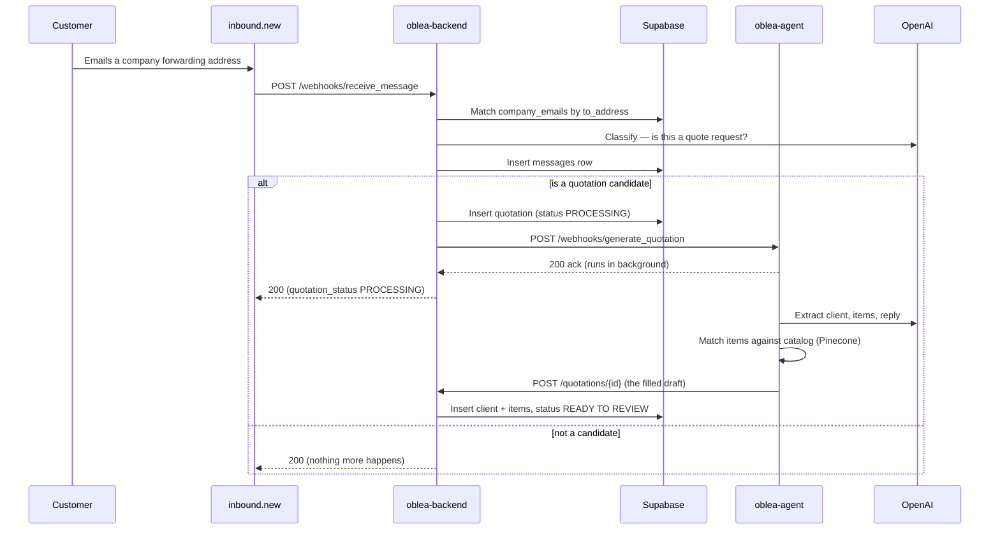

Everything in Oblea starts with a message and ends with a quotation a human reviews. This page traces a single quote-request email through every service and every table it touches.

## The full journey

## Step by step

<Steps>
  <Step title="A customer emails a forwarding address">
    Each company registers forwarding addresses through [`POST /integrations`](/integrations/create). They look like `ventas-empresa-a1b2c@in.quotenow-app.com`. A customer sends a quote request to one of them, and `inbound.new` receives it.
  </Step>

  <Step title="inbound.new webhooks the backend">
    `inbound.new` delivers the parsed email to [`POST /webhooks/receive_message`](/webhooks/receive-message). The payload carries the sender, subject, body (text and HTML), and any attachments.
  </Step>

  <Step title="The backend matches the address to a company">
    The recipient address is looked up in `company_emails`. No match → `404`, and nothing is stored (spam and mis-directed mail is dropped). A match resolves the owning **`company`**.
  </Step>

  <Step title="OpenAI classifies the message">
    The subject, body, and attachment metadata (or an image itself) go to the model, which returns `{ is_quotation_candidate, confidence, reason }`. Classification never blocks storage — if it fails, `triggered_quotation` is stored as `null`.
  </Step>

  <Step title="The message is stored">
    A **`messages`** row is inserted with the raw payload, the classification verdict, and its metadata. Re-deliveries of the same `provider_message_id` are detected and de-duplicated (`200` with `duplicate: true`).
  </Step>

  <Step title="A quotation is created (if it's a candidate)">
    If the message is a quote request, a **`quotation`** row is created immediately with `status = PROCESSING`, linked back to its `source_message_id`, and defaulted to the company's email as `sales_person`.
  </Step>

  <Step title="The backend hands off to the agent">
    The backend calls `oblea-agent` at `POST /webhooks/generate_quotation` with the quotation id and the email content. The agent **acks instantly and does the heavy work in the background**, so `inbound.new` is never left waiting. The webhook responds `200` with `quotation_status: "PROCESSING"`.
  </Step>

  <Step title="The agent extracts and matches">
    The agent uses the LLM to extract the customer (`client`), the requested line `items`, a short `name`, `notes`, and a proposed reply (`send_message`). It embeds each item and matches it against the company's catalog in Pinecone — the best match pins `item_id`, the runners-up become suggestions.
  </Step>

  <Step title="The agent fills the draft">
    The agent posts the finished draft back to [`POST /quotations/{id}`](/quotations/store-agent-draft). The backend inserts the `client`, the `quotation_items`, and any `suggested_items`, then flips the status to **`READY TO REVIEW`**.
  </Step>

  <Step title="A human reviews it">
    The sales person opens the quotation in the frontend — served by [`GET /quotations/{id}`](/quotations/get) — edits line items and prices, and sends it. The final document is generated deterministically from the reviewed draft.
  </Step>
</Steps>

## Quotation statuses

A quotation moves through a small set of statuses. The backend sets the first two automatically; later ones are driven by human review.

<CardGroup cols={3}>
  <Card title="PROCESSING" icon="spinner">
    Created the moment a candidate email arrives. The agent is filling it in the background.
  </Card>
  <Card title="READY TO REVIEW" icon="user-check">
    The agent finished. Client, items and a proposed reply are attached, waiting on a human.
  </Card>
  <Card title="SENT" icon="paper-plane">
    The sales person approved and sent the quotation to the customer.
  </Card>
</CardGroup>

<Note>
  Quotations created by hand through [`POST /quotations`](/quotations/create) default to the database status `draft` instead of `PROCESSING` — that path is not part of the email pipeline and skips the agent entirely.
</Note>

## What each step writes

| Step | Table written | By |
| --- | --- | --- |
| Store the message | `messages` | Backend (webhook) |
| Create the draft | `quotation` (`PROCESSING`) | Backend (webhook) |
| Fill the draft | `client`, `quotation_items`, `suggested_items`, `quotation` (`READY TO REVIEW`) | Backend (agent draft) |

Notice the agent **never writes to the database directly** — it always goes back through this API. That keeps the backend the single writer and the single source of truth.
